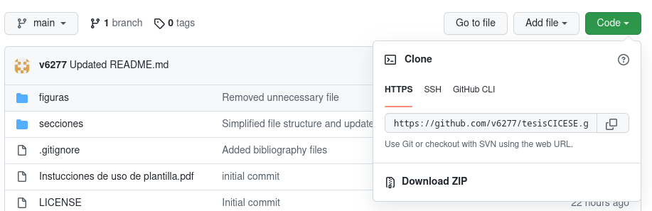

# tesisCICESE
Plantilla en LaTeX para la escritura de tésis requerida para la obtención de (pos)grado en el Centro de Investigación Científica y de Educación Superior de Ensenada (CICESE), Baja California. Esta plantilla es un *fork* de la plantilla oficial ofrecida por parte de la [biblioteca][biblio-cicese] de CICESE para la elaboración de tésis. 


### Información del README original
"Esta plantilla es producto de adecuaciones técnicas de una versión proporcionada por alumnos del Departamento de Computación del CICESE (desconozco los orígenes a profundidad)."

**LA ULTIMA ACTUALIZACIÓN CORRESPONDE AL:** Mayo de 2022
NOTA: se les pide a futuras generaciones, que mantengan actualizado esta plantilla, actualicen la fecha correspondiente y coloquen el nombre de las personas que participaron en la mejora de este formato.

**LISTA DE ALUMNOS QUE HAN COLABORADO EN LA ACTUALIZACIÓN DE ESTA PLANTILLA**

| DEPARTAMENTO | NOMBRE                 |
|--------------|------------------------|
| MCC | Alejandro Flores Lamas |  
| MCC | Ana Karen Velázquez Sánchez |  
| DC | Héctor Zatarain Aceves |
| MCC | Netzahualcóyotl Hernández Cruz |
| MCC	| Darién Alberto Miranda Bojórquez |
| DC | Claudia Ivette García Gil |
| Biblioteca | Alma Lilia Nuñuez Rodríguez |
| Biblioteca | Oscar Peña Ramírez |
| Ing. | Victor Hugo Medina Macias |
  

## Instrucciones de uso

### En Overleaf
1. Crea una cuenta en [Overleaf][overleaf].

2. Inicia un nuevo proyecto en la barra izquierda en el homepage de tu cuenta.

3. Dale click en importar desde github o subir proyecto.
   * Importar proyecto sólo está disponible para usuarios premium.
   * Para subir el proyecto, se debe descargar el .zip desde este repositorio. El link de descarga se encuentra en la parte superior de esta página, bajo la botón de "código" en verde.



### Localmente
Se recomienda usar Overleaf por facilidad de uso y respaldo de información, pero si por alguna razón gustas usar el documento y compilarlo localmente en tu ordenador se incluye esta sección. 

Se debe de tener una instalación local de LaTeX antes de poder compilar el archivo. Para Linux, revisa la documentación de tu distribución para ver los paquetes de LaTeX disponibles. Usualmente se incluyen bajo el paquete de texlive. Si tienes dudas de cómo encontrar los paquetes incluidos en tu distribución, corre una búsqueda en un motor de búsqueda (Google, Duckduckgo, etc.) con los términos "latex \<*mi distribución*\>". Por ejemplo, "latex ubuntu" o "latex fedora". 

Para windows, se recomienda usar [proTeXt][protext], un entorno de desarrollo integrado que incluye MiKTeX (una distribución de LaTeX) y un editor de LaTeX gráfico. 

1. Descarga los archivos usando git o descarga el archivo .zip y desempaca el contenido en el directorio deseado.
   * **Con git:** En una terminal, ve al directorio deseado y corre `git clone https://github.com/v6277/tesisCICESE.git`

2. Compila el archivo tesisCICESE.tex usando pdflatex en la terminal (corre `pdflatex tesisCICESE.tex`), o si usas un editor gráfico revisa las instrucciones propias del editor.

Se creará un archivo tesisCICESE.pdf en la raíz de la carpeta.

**IMPORTANTE: SÓLO DEBES EDITAR EL ARCHIVO *tesisCICESE.tex* Y LOS ARCHIVOS QUE SE ENCUENTRAN BAJO LA CARPETA *secciones* QUE CORRESPONDEN A LAS SECCIONES DE TU TESIS.**

## Ayuda
### Quiero agregar capítulos a mi tésis
La plantilla cuenta con los archivos para Resumen, Abstract, Dedicatoria, Agradecimientos, Introducción (incluye Antecedentes, Justificación (opcional), Hipótesis (opcional), y Objetivos), Metodología, Resultados, Discusión, Conclusiones, Literatura Citada y un Anexo. Estas secciones son las que vienen en las instrucciones generales de la [guía para la escritura de tésis][guiaTesis] más reciente (Mayo de 2022). 

Si deseas agregar otro capítulo a tu tésis, es necesario crear *nombredearchivo.tex* dentro de la carpeta de *secciones* y se modifica la sección correspondiente dentro de *tesisCICESE.tex* agregando: 
```tex
{\normalsize 
\input{secciones/nombredearchivo.tex}
\newpage }
```


### Quiero usar mi archivo de Mendeley para la literatura citada.
Es posible usar tu archivo generado de Mendeley para coordinar tu bibliografía. Reemplaza el archivo literaturaTesis.bib con tu archivo .bib de Mendeley y recompila el documento. Es importante que el nuevo archivo también lleve el nombre de literaturaTesis.bib. Para que se muestren los cambios en el índice, en las citas y en la lista de la literatura citada puede ser necesario compilar el documento más de una vez. 

### No sé usar LaTeX
El internet incluye muy buenos recursos para aprender LaTeX.

* [*Learn LaTeX in 30 minutes* de overleaf.com (inglés)][learnlatexoverleaf]
* [learnlatex.org][learnlatex]
* [**Libro:** La introducción no-tan-corta a LaTeX2e][learnlatex2e]
* [Manual de LaTeX wiki][latexwiki]

[biblio-cicese]: https://biblioteca.cicese.mx/
[overleaf]: https://www.overleaf.com/
[protext]: https://tug.org/protext/
[guiaTesis]: ./guia_tesis_04-20-2022.docx
[learnlatexoverleaf]: https://es.overleaf.com/learn/latex/Learn_LaTeX_in_30_minutes
[learnlatex]:https://www.learnlatex.org/es/
[learnlatex2e]: https://lorca.act.uji.es/curso/latex/documento/lshort-a4.pdf
[latexwiki]: https://es.wikibooks.org/wiki/Manual_de_LaTeX